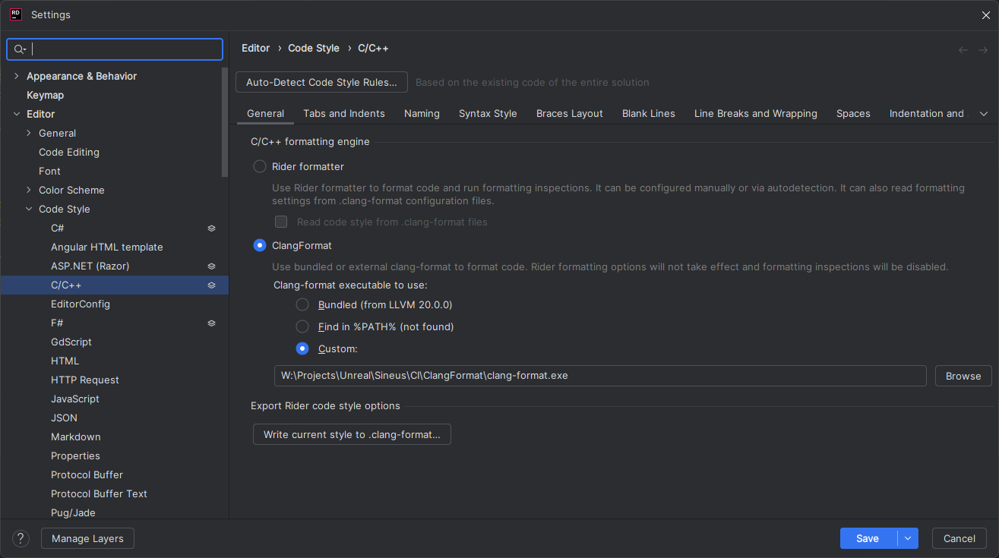
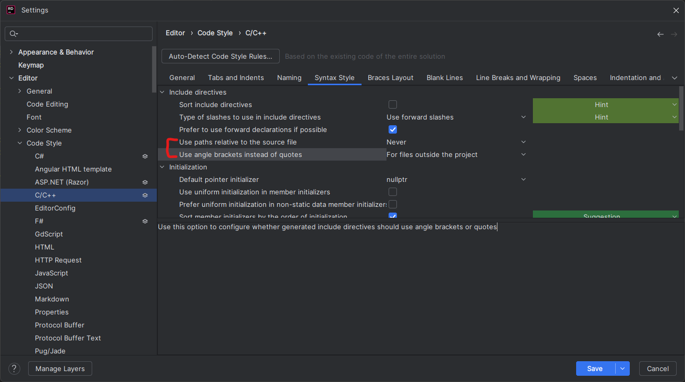
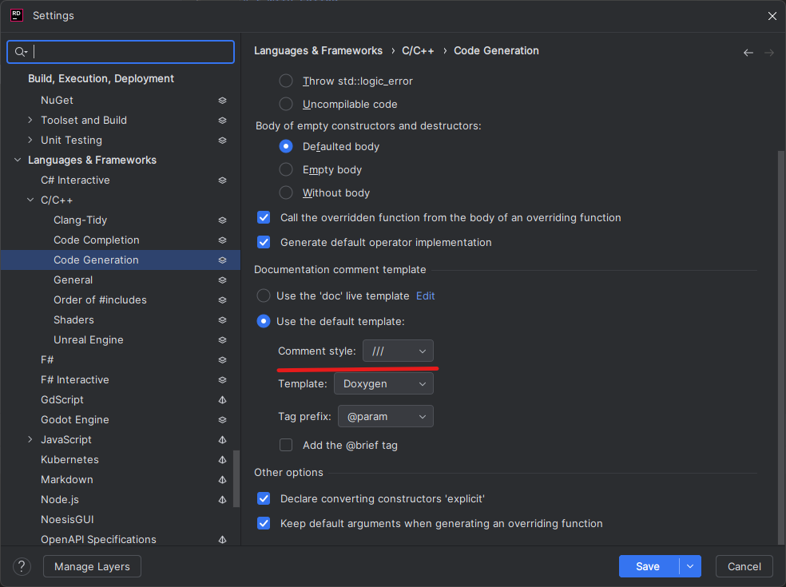

### You can manually enable settings instead of importing full settings.zip:

1. Settings -> Editor -> Code Style -> C/C++ -> General tab -> Set 'C/C++ formatting engine' to 'ClangFormat'  
P.S. set executable to either Bundled or Custom (you can find clang-format.exe at CI/ClangFormat)  

2. Settings -> Editor -> Code Style -> C/C++ -> Syntax Style tab -> Set 'Use paths relative to the source  files' to 'Never'
3. Settings -> Editor -> Code Style -> C/C++ -> Syntax Style tab -> Set 'Use angle brackets instead of quotes' to 'For files outside the project'

4. Settings -> Languages & Frameworks -> C/C++ -> Code Generation -> Documentation comment template -> set 'Comment style' to '///'

